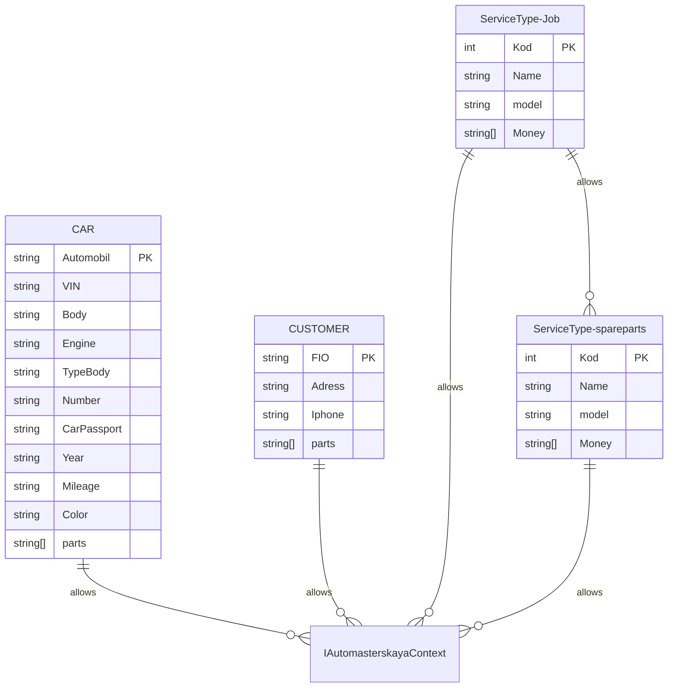

```mermaid

erDiagram
    CAR ||--o{ IAutomasterskayaContext : allows
    CAR {
        string Automobil PK
        string VIN
        string Body
        string Engine
        string TypeBody
        string Number
        string CarPassport
        string Year
        string Mileage
        string Color
        string[] parts
    }
     CUSTOMER ||--o{ IAutomasterskayaContext : allows
    CUSTOMER {
        string FIO PK
        string Adress
        string Iphone
        string[] parts
    }
  ServiceType-Job ||--o{ IAutomasterskayaContext : allows

    ServiceType-Job {
        int Kod PK
        string Name
        string model
        string[] Money
    }
  ServiceType-spareparts ||--o{ IAutomasterskayaContext : allows
    ServiceType-spareparts {
        int Kod PK
        string Name
        string model
        string[] Money
    }
  ServiceType-Job ||--o{ ServiceType-spareparts : allows
```
